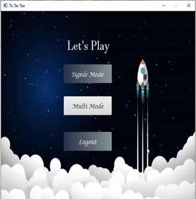

# Tic-Tac-Toe
Network based Tic-Tac-Toe game, implemented with JavaFX as a project in ITI Open Source Application Development track intake-41.

# Table of content

* [Install and config](https://github.com/montaser223/Tic-Tac-Toe#install-and-config)

* [Demo](https://github.com/montaser223/Tic-Tac-Toe#demo)

* [Prerequisite](https://github.com/montaser223/Tic-Tac-Toe#prerequisites)

* [Features](https://github.com/montaser223/Tic-Tac-Toe#features)

* [Used Technologies](https://github.com/montaser223/Tic-Tac-Toe#used-technolgies)

* [Team members](https://github.com/montaser223/Tic-Tac-Toe#team)

# Getting Started
# Install and config
* How to run the Server
  - open project in netbeans or intellij idea
  - open File
    - Project Properties
    - Libraries and make sure that following libraries are included
        - json-simple-1.1.1
        - gson-2.6.2
        - mysql-connector-java-5.1.49-bin
    - Sources -> Add Folder -> Add ProjectImg Folder
   - Import xo_db.sql file to phpmyadmin
   - Run XAMPP
   - In netbeans open service tab  add new driver "jdbc:mysql://localhost:3306/xo_db" and make sure there is a mysql server at the "localhost" on port 3306 also add a user named "root" with empty password then allow this user's access on database names "xo_db"
   - connect the previos driver
   - Move to projects tab and make sure from existance of two packages in Server project first one is libs package and second is server
   - clean and build the server project then Run ServerGUI.java file
   
 * How to run the Client
    - open project in netbeans or intellij idea
    - open File
      - Project Properties
      - Libraries and make sure that following libraries are included
          - json-simple-1.1.1
          - gson-2.6.2
      - Sources -> Add Folder -> Add ProjectImg Folder
    - Make sure from existance of two packages in Client project first one is libs package and second is client
   - clean and build the client project then Run Client.java file
## [Demo](https://drive.google.com/file/d/18ITYb7UKVlUwUQSZWtQ5dUB2gi76hV4f/view?usp=sharing)

                                                
# Prerequisites
* java 8 or higher recommended
* firewall configured for socket communications

# Features
* Server implemented with User Friendly GUI
  - Ability to start / stop the server
  - View the player list (online and offline) with each player points
* Client implemented with User Friendly GUI
  - LogIn
  - Sign up as a first time player.
  - After player sign in:
      - Showing Online/Offline status of players on the updated players list after sign in.
      - Allow the player to play in single mode( play with the computer)
      - Player can ask any online player to play with him.
      - Allow two players to play together after the second player accepts the invitation.
      - Player can chat with the other player through game chat
 - The application give the user an option to record the game and store it at the server for replay later.
 - The application give the player bounce points when the player wins.
 # Used Technolgies
 - [MySQL](https://dev.mysql.com/downloads/connector/j/)- JDBC Type 4 driver for MySQL
 - [json-simple](https://code.google.com/archive/p/json-simple/)- A simple Java toolkit for JSON
 
 # Team
 - Abo Bakr Yousre
 - Abd El-Rahman Montaser
 - Eman Reda Soliman
 - Heba Mostafa Mohamed
 - Mohamed Mahmoud Mohamed Kaoud 
 - Omnia Mostafa Khalaf
 
 
   
